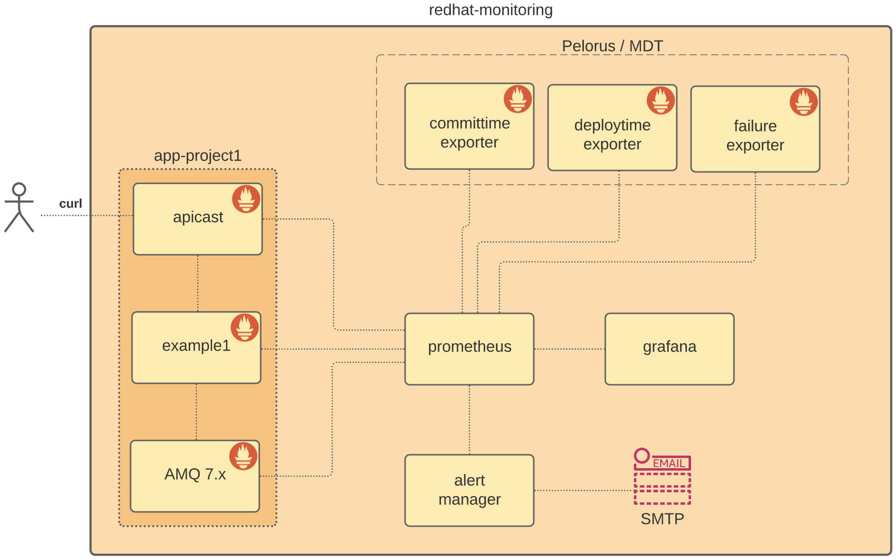
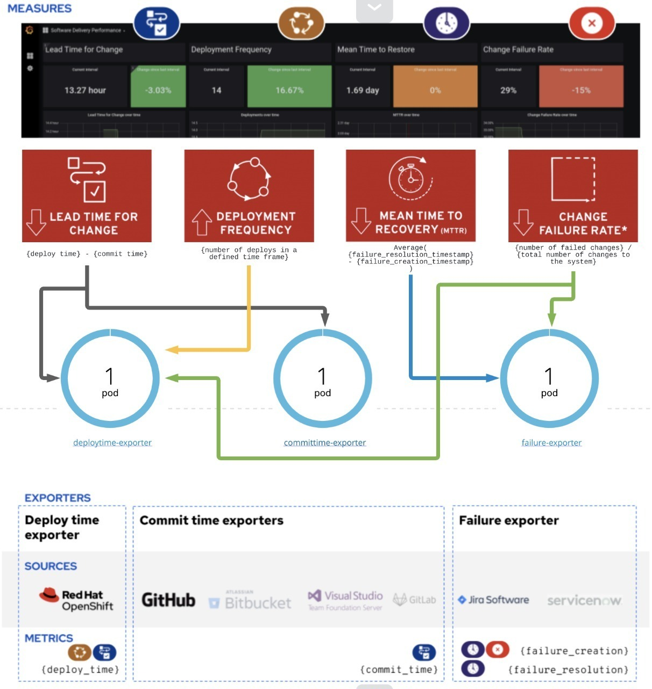

# redhat-monitoring

Prometheus + Alertmanager + Grafana (Tablero DevOps (MDT) / Metricas Fuse / AMQ / Apicast 3scale)

## Diseño

- **apicast**: API Gateway
- **example1**: APP de ejemplo para simular trafico
- **AMQ 7.x**: Cola de mensajeria, utilizada por "example1" para simular una falla, enviar los mensajes a la DLQ y pueda activarse una de las reglas configuradas en prometheus.
- **prometheus**: Es el encargado de recolectar las metricas expuestas por los demas componentes (apicast / AMQ / example1 y exporters (committime, deploytime y failure) Pelorus / MDT)
- **alertmanager**: Componente encargado de notificar cuandos se activa una alerta en 'prometheus'
- **grafana**: Componente donde se visualizan los dashboard y que se hidrata a travez de un DataSource configurado hacia 'prometheus'

## Demo

## Procedimiento instalación

- __[Paso 1](#instalar-minishift-okd)__ - Procedimiento de instalación de Minishift (OKD).
- __[Paso 2](#prometheus-y-alermanager)__ - Procedimiento de instalación Prometheus y alertmanager
- __[Paso 3](#exporters-mdt)__ - Procedimiento de instalación Exporter tablero DevOps (MDT).
- __[Paso 4](#grafana)__ - Procedimiento de instalación Grafana.
- __[Paso 5](#ejemplo)__ - Despliegue aplicación de ejemplo (junto con AMQ, Apicast y Fake SMTP)

## instalar minishift (okd)

### macosx

    wget https://github.com/minishift/minishift/releases/download/v1.34.2/minishift-1.34.2-darwin-amd64.tgz
    tar -tlvf minishift-1.34.2-darwin-amd64.tgz
    sudo cp minishift-1.34.2-darwin-amd64/minishift /usr/local/bin/minishift
    sudo chmod 777 /usr/local/bin/minishift

### driver (hyperkit)

    sudo curl -L  https://github.com/machine-drivers/docker-machine-driver-hyperkit/releases/download/v1.0.0/docker-machine-driver-hyperkit -o /usr/local/bin/docker-machine-driver-hyperkit
    sudo chown root:wheel /usr/local/bin/docker-machine-driver-hyperkit
    sudo chmod u+s,+x /usr/local/bin/docker-machine-driver-hyperkit

### start

    minishift addon enable admin-user
    minishift addon enable anyuid
    minishift addon enable xpaas
    minishift addon enable registry-route
    minishift addon enable redhat-registry-login

    minishift start --cpus=4 --memory=10GB --disk-size=60GB --vm-driver hyperkit --skip-registration
    minishift openshift config set --patch '{"jenkinsPipelineConfig":{"autoProvisionEnabled":true}}'

#### Adding the cluster admin role, to the 'admin' user in Minishift

    minishift ssh
    docker exec -it origin bash
    oc --config=/var/lib/origin/openshift.local.config/master/admin.kubeconfig  adm policy  --as system:admin add-cluster-role-to-user cluster-admin admin
    exit
    exit

## instalar stack monitoreo

    oc login https://$(minishift ip):8443 -u admin
    oc create route edge --service=docker-registry -n default

---

    MONITOR_PROJECT=redhat-monitoring
    oc new-project ${MONITOR_PROJECT}

### prometheus y alermanager

Dentro del archivo prometheus.yml estan contenidos todos la configuracion de reglas y alertas tanto para prometheus como alertmanager necesarias extraer la informacion de los exporter para tablero DevOps como asi las metricas de Fuse / AMQ y Apicast.

    oc new-app -f prometheus.yml -p NAMESPACE=${MONITOR_PROJECT} -p PROMETHEUS_DATA_STORAGE_SIZE=1Gi -p ALERTMANAGER_DATA_STORAGE_SIZE=1Gi

### exporters (pelorus / MDT)

Los exporters de pelorus son los encargados de extraer las metricas de despliegue/commit de las aplicaciones del proyecto que esta monitoreando, como asi tambien el estado de los ticket en JIRA del proyecto que se haya configurado.

#### creamos las imágenes

    docker build -q --rm -t pelorus/committime ./exporters/committime/
    docker build -q --rm -t pelorus/deploytime ./exporters/deploytime/
    docker build -q --rm -t pelorus/failure ./exporters/failure/

#### exportarmos imágenes a openshift

    oc login https://$(minishift ip):8443 -u admin
    docker login -u admin -p $(oc whoami -t) docker-registry-default.$(minishift ip).nip.io

    docker tag pelorus/committime docker-registry-default.$(minishift ip).nip.io/openshift/committime:latest
    docker push docker-registry-default.$(minishift ip).nip.io/openshift/committime:latest

    docker tag pelorus/deploytime docker-registry-default.$(minishift ip).nip.io/openshift/deploytime:latest
    docker push docker-registry-default.$(minishift ip).nip.io/openshift/deploytime:latest

    docker tag pelorus/failure docker-registry-default.$(minishift ip).nip.io/openshift/failure:latest
    docker push docker-registry-default.$(minishift ip).nip.io/openshift/failure:latest

#### config

    GITHUB_USER=damianlezcano
    GITHUB_TOKEN=yyyy

    JIRA_TOKEN=yyyy
    JIRA_USER=lezcano.da@gmail.com
    JIRA_SERVER=https://damianlezcano.atlassian.net
    JIRA_PROJECT=AGIL

#### intanciamos los exporters

	oc adm policy add-cluster-role-to-user view system:serviceaccount:redhat-monitoring:default -n ${MONITOR_PROJECT}

    oc new-app committime:latest --name committime-exporter -e APP_FILE=exporter/app.py -e OPENSHIFT_BUILD_NAME=commiter-exporter -e NAMESPACES=app-project1 -e APP_LABEL=app -e LOG_LEVEL=DEBUG -e GITHUB_USER=${GITHUB_USER} -e GITHUB_TOKEN=${GITHUB_TOKEN} -e GITHUB_API_BAK=api.github.com -n ${MONITOR_PROJECT}

    oc new-app deploytime:latest --name deploytime-exporter -e APP_FILE=exporter/app.py -e OPENSHIFT_BUILD_NAME=deploytime-exporter -e NAMESPACES=app-project1 -e APP_LABEL=app -e LOG_LEVEL=DEBUG -n ${MONITOR_PROJECT}

    oc new-app failure:latest --name failure-exporter -e APP_FILE=exporter/app.py -e OPENSHIFT_BUILD_NAME=failure-exporter -e APP_LABEL=app -e LOG_LEVEL=DEBUG -e TOKEN=${JIRA_TOKEN} -e USER=${JIRA_USER} -e SERVER=${JIRA_SERVER} -e PROJECT=${JIRA_PROJECT} -n ${MONITOR_PROJECT}

    oc expose service committime-exporter -n ${MONITOR_PROJECT}
    oc expose service deploytime-exporter -n ${MONITOR_PROJECT}
    oc expose service failure-exporter -n ${MONITOR_PROJECT}

    oc label service committime-exporter job=openshift-state-metrics -n ${MONITOR_PROJECT}
    oc label service deploytime-exporter  job=openshift-state-metrics -n ${MONITOR_PROJECT}
    oc label service failure-exporter job=openshift-state-metrics -n ${MONITOR_PROJECT}

### grafana

Dashboard:

    oc create configmap grafana-dashboards --from-file=grafana-dashboard-mdt.json --from-file=grafana-dashboard-fuse.json --from-file=grafana-dashboard-amq.json --from-file=grafana-dashboard-apicast.json -n ${MONITOR_PROJECT}

Instalamos:

    oc new-app -f grafana.yaml -p NAMESPACE=${MONITOR_PROJECT}

### Ejemplo

#### app-project1 (build jenkins strategy)

Crear secret con credenciales para descargar imagenes de registry.redhat.io

    oc project openshift
    # https://access.redhat.com/RegistryAuthentication
    oc create -f 5318211_okd-secret.yaml
    oc secrets link default 5318211-okd-pull-secret --for=pull
    oc secrets link builder 5318211-okd-pull-secret

Importamos imagenes al namespace openshift:

    oc import-image fuse7/fuse-java-openshift:1.2 --from=registry.redhat.io/fuse7/fuse-java-openshift --confirm
    oc import-image amq7/amq-broker-rhel7-operator:0.13 --from=registry.redhat.io/amq7/amq-broker-rhel7-operator:0.13 --confirm
    oc import-image amq7/amq-broker:7.6 --from=registry.redhat.io/amq7/amq-broker:7.6 --confirm
    oc import-image 3scale-amp2/apicast-gateway-rhel7 --from=registry.redhat.io/3scale-amp2/apicast-gateway-rhel7 --confirm

Configuramos credenciales para que jenkins acceda al repositorio
    
    oc new-project app-project1

    oc create secret generic repository-credentials --from-literal=username=${GITHUB_USER} --from-literal=password=${GITHUB_TOKEN} --type=kubernetes.io/basic-auth -n app-project1

    oc label secret repository-credentials credential.sync.jenkins.openshift.io=true -n app-project1
    
    oc annotate secret repository-credentials 'build.openshift.io/source-secret-match-uri-1=ssh://github.com/*' -n app-project1

Desplegamos AMQ

    oc create -f amq-broker-operator/service_account.yaml -n app-project1
    oc create -f amq-broker-operator/role.yaml -n app-project1
    oc create -f amq-broker-operator/role_binding.yaml -n app-project1
    oc create -f amq-broker-operator/crds/broker_activemqartemis_crd.yaml -n app-project1
    oc create -f amq-broker-operator/crds/broker_activemqartemisaddress_crd.yaml -n app-project1
    oc create -f amq-broker-operator/crds/broker_activemqartemisscaledown_crd.yaml -n app-project1
    oc create -f amq-broker-operator/operator.yaml -n app-project1
    oc create secret generic broker-amq-credentials-secret --from-literal=clusterUser=clusterUser --from-literal=clusterPassword=clusterPassword --from-literal=AMQ_USER=admin --from-literal=AMQ_PASSWORD=admin -n app-project1
    oc create -f amq-broker-operator/crs/broker_activemqartemis_cr.yaml -n app-project1
    oc set env statefulset broker-amq-ss AMQ_ENABLE_METRICS_PLUGIN=true -n app-project1

Desplegamos Fake email para poder visualizar las notificaciones de alertmanager

    oc new-app mailhog/mailhog -n ${MONITOR_PROJECT}
    oc expose svc/mailhog --port=8025 -n ${MONITOR_PROJECT}

Desplegamos app example1

    oc create -f https://raw.githubusercontent.com/damianlezcano/prometheus-example-fuse/master/template.yaml -n app-project1

    oc new-app --template java-app-deploy -p APP_NAME=example1 -p GIT_REPO=https://github.com/damianlezcano/prometheus-example-fuse.git -p GIT_BRANCH=master -n app-project1

    oc start-build example1-pipeline -n app-project1

Desplegamos apicast

    cd apicast
    mvn clean package -DskipTests -s settings.xml
    docker build -t apicat-proxy .

    docker tag apicast-proxy docker-registry-default.$(minishift ip).nip.io/openshift/apicast-proxy:latest
    docker push docker-registry-default.$(minishift ip).nip.io/openshift/apicast-proxy:latest

    oc new-app -f apicast.yml -p APICAST_NAME=apicast-staging -p DEPLOYMENT_ENVIRONMENT=staging -p CONFIGURATION_LOADER=lazy -p EXTENDED_METRICS=true -p CONFIGURATION_FILE_PATH=/opt/config/local.json -p APICAST_URL=apicast-staging-app-project1.$(minishift ip).nip.io -n app-project1

Generar commit para el tablero DevOps (MDT)

    git clone https://github.com/damianlezcano/prometheus-example-fuse.git
    cd prometheus-example-fuse
    
    date > version.txt
    
    git add .;git commit -m "Cambio en version";git push

    oc start-build example1-pipeline -n app-project1

Generamos tráfico para el trablero de metricas (fuse / amq  y apicast)

    curl --location --request GET 'http://apicast-staging-app-project1.192.168.64.14.nip.io/api/say?user_key=foo&hello=world'

_Si se reemplaza 'world' por 'error' esto genera un error en la ruta camel enviando el mensaje a la DLQ, permitiendo activar luego de mas de 10 intentos una de las reglas configuradas en prometheus y generando finalmente una notificacion por email (Ir a http://mailhog-${MONITOR_PROJECT}.${minishift ip}.nip.io/)_